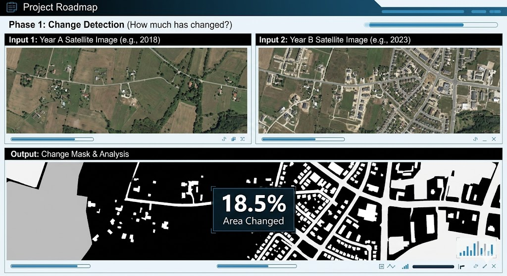
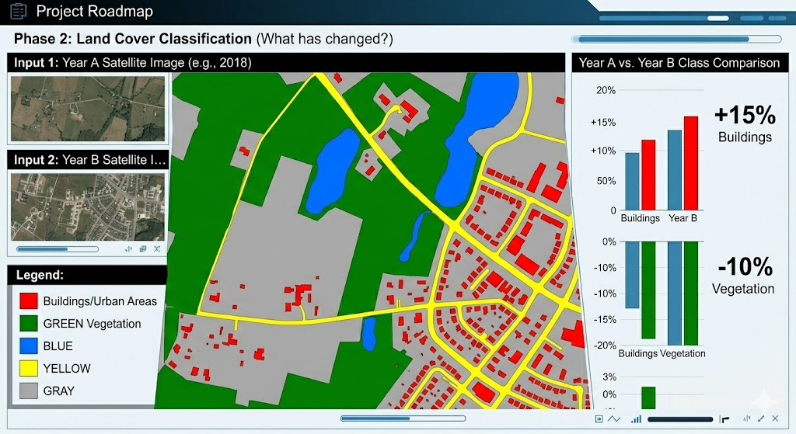
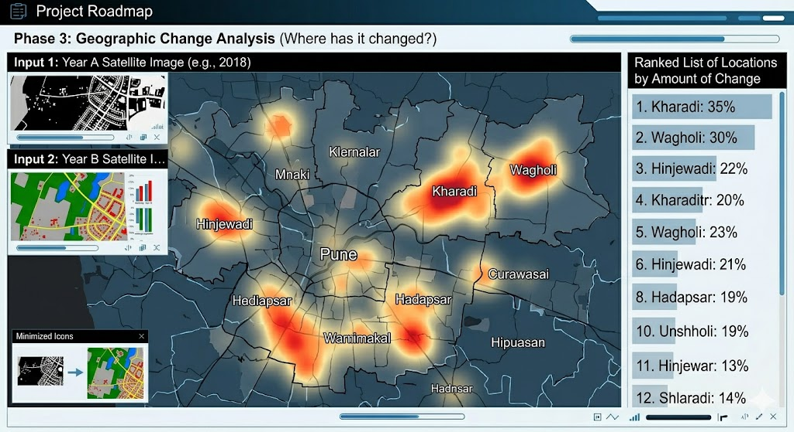
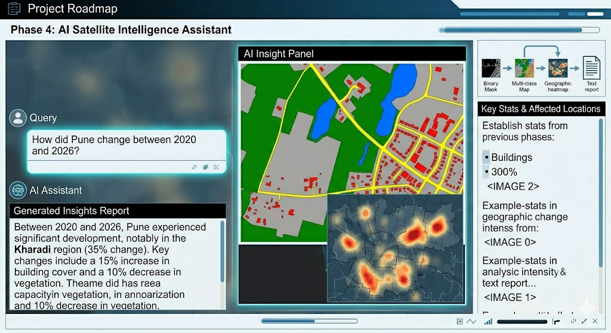

# Project Roadmap

## Phase 1 — Change Detection (How much has changed?)

The first phase focuses on identifying whether a region has changed over time. The system takes two satellite images of the same location from different years and uses a change detection model to compare them pixel-by-pixel.

The output is a binary change mask where changed regions are highlighted. The system also calculates the percentage of the total area that has undergone changes.

**Input:**

* Satellite image (Year A)
* Satellite image (Year B)

**Output:**

* Change mask highlighting modified regions
* Percentage of area changed

---

## Phase 2 — Land Cover Classification (What has changed?)

After detecting where changes occurred, the second phase focuses on understanding the type of change. The system classifies different land categories such as buildings, vegetation, water bodies, roads, and empty land.

By comparing land classifications across different years, the system can quantify changes such as urban expansion, vegetation loss, or changes in water coverage.

Future improvements may combine Phase 1 change masks with land classification masks to provide color-coded visualizations of different types of changes.

**Example:**

* Buildings: +15%
* Vegetation: -10%
* Water bodies: -3%

**Output:**

* Multi-class land cover map
* Statistics describing how each land category changed
* Color-coded change visualization

---

## Phase 3 — Geographic Change Analysis (Where has it changed?)

The third phase focuses on identifying which specific locations experienced the most significant changes.

The region is divided into smaller geographic areas, and the system calculates change statistics for each location. This allows the AI to identify regions with rapid development, deforestation, or other significant transformations.

**Example:**

* Kharadi: 35% changed area
* Wagholi: 30% changed area
* Other regions: Lower levels of change

**Output:**

* Ranked list of locations by amount of change
* Heatmaps showing change intensity across the region

---

## Phase 4 — AI Satellite Intelligence Assistant

The final phase introduces an LLM-powered analysis layer that converts technical satellite data into understandable reports.

The AI receives outputs from the previous phases, including change masks, land classifications, statistics, and geographic information, and generates human-readable insights.

Users will be able to ask natural language questions such as:

*"How did Pune change between 2020 and 2026?"*

The AI will provide a detailed report containing:

* Visual change maps
* Key statistics
* Areas of major transformation
* Possible environmental and urban development insights

---

