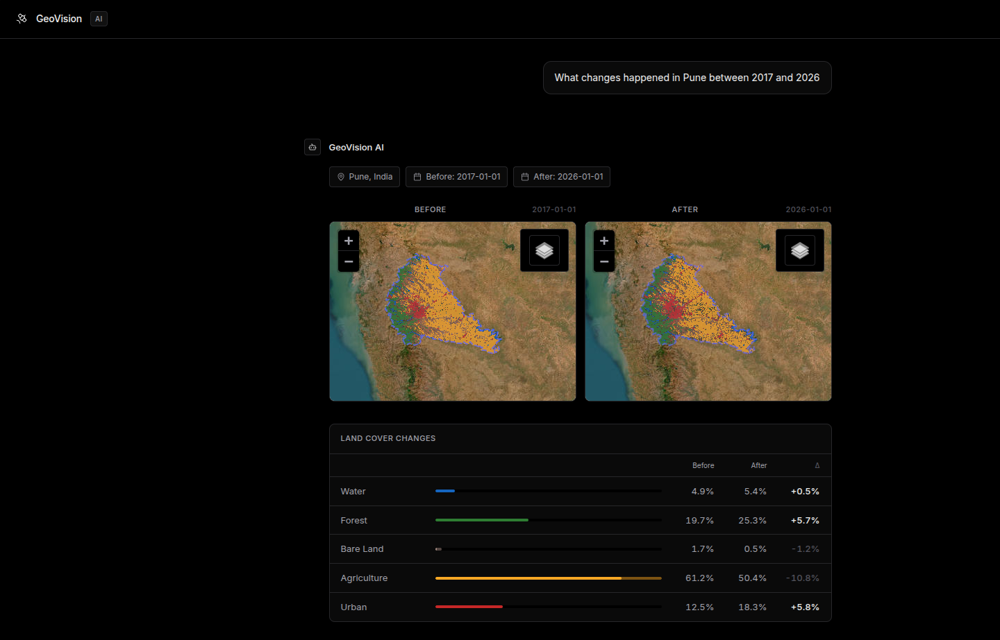
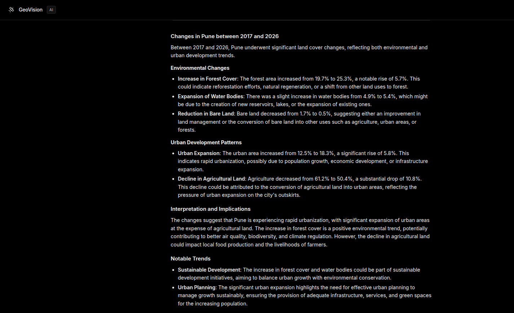

# GeoVision

Satellite change detection powered by Google Earth Engine, Dynamic World land cover classification, and AI driven natural language explanations.

## Overview

Existing land-cover products often expose raw classifications but don't help users ask natural language questions or understand changes. GeoVision combines satellite imagery, land-cover analysis, and AI explanations into an interactive system for exploring environmental change.

GeoVision is a web application that analyzes satellite imagery to detect land cover changes over time. It leverages Sentinel 2 multispectral data and Dynamic World probability maps to identify transitions between land cover classes such as forest, urban, water, agriculture, and bare land. The system features an AI chat interface that lets users ask questions about land use changes in natural language, with real time streaming updates and detailed AI generated explanations.

<p align="center">
  
</p>

<p align="center">
  
</p>

## Features

* **Natural Language Chat Interface**: Ask about land use changes in plain English. The AI parses your intent, location, and date range automatically.
* **Sentinel 2 Composite Generation**: Cloud filtered median composites with Scene Classification Layer masking for clean, analysis ready imagery.
* **Dynamic World Analysis**: Per pixel probability classification into 9 land cover classes using Google's Dynamic World dataset.
* **Change Detection Engine**: Rule based detection with confidence gates, probability surge validation, and spectral cross validation using NDVI and NDWI indices.
* **AI Powered Explanations**: LLM generated summaries of detected changes with context about environmental and societal implications.
* **Interactive Maps**: Leaflet based visualization with satellite basemaps, before/after composites, change masks, and land cover classification layers.
* **Real Time Streaming**: Server Sent Events provide live pipeline progress updates from geocoding through final analysis.
* **Administrative Boundary Support**: District level analysis via FAO GAUL Level 2 boundaries or city/town level via OpenStreetMap.
* **Land Cover Statistics**: Quantitative breakdowns with per class percentages and delta calculations.
* **Light/Dark Theme Toggle**: Persistent theme preference with smooth transitions.


## Technology Stack

* **Backend**: Python, Flask
* **Earth Engine**: Google Earth Engine (Python API)
* **Satellite Data**: Sentinel 2 SR (COPERNICUS/S2_SR_HARMONIZED), Dynamic World (GOOGLE/DYNAMICWORLD/V1)
* **Geocoding**: Nominatim (geopy)
* **Boundary Data**: FAO GAUL 2015 (Level 2), OpenStreetMap (OSMnx)
* **LLM**: Groq API (Llama 3.3 70B Versatile)
* **Frontend**: Vanilla JavaScript, Leaflet, Lucide icons, Marked.js
* **Spatial**: Shapely, GeoPandas (via OSMnx)


## Architecture

The application follows a modular pipeline architecture:

```
Geocode Location
       |
       v
Resolve AOI (GAUL District / OSM City)
       |
       v
Fetch Sentinel 2 Composite (Before)
       |
       v
Fetch Sentinel 2 Composite (After)
       |
       v
Build Dynamic World Probability Maps (Before + After)
       |
       v
Detect Changes (Rule Engine + Spectral Cross Validation)
       |
       v
Compute Land Cover Statistics
       |
       v
Generate AI Explanation (Groq LLM)
```

### Pipeline Steps

1. **Geocoding**: Resolves user provided location strings to lat/lon coordinates via Nominatim.
2. **AOI Resolution**: Looks up the corresponding FAO GAUL Level 2 district boundary, or uses OSM to find a city/town polygon.
3. **Composite Building**: Fetches Sentinel 2 SR Harmonized scenes, applies cloud filtering and SCL masking, then computes a median composite for each time period.
4. **Dynamic World Processing**: Medians Dynamic World probability bands to create stable per pixel class distributions.
5. **Signature Mapping**: Maps 9 band DW probabilities into a 5 class schema (Water, Forest, Bare Land, Agriculture, Urban) with dominance margins and confidence floors.
6. **Change Detection**: Applies a three gate rule engine per approved transition:
   * Confidence gate: both endpoints must exceed minimum class proportion
   * Surge gate: target class probability must increase significantly
   * Spectral gate: NDVI/NDWI cross validation to reject false positives
7. **Statistics**: Computes per class pixel counts and percentages using GEE reduceRegion.
8. **Explanation**: Formats results and land cover stats into a prompt for the Groq LLM to generate natural language insights.


## Installation

### Prerequisites

* Python 3.10 or higher
* A Google Earth Engine account with a registered cloud project
* A Groq API key (for AI explanations and chat features)

### Setup

1. Clone the repository:
```bash
git clone https://github.com/Vedant-Git-dev/GeoVision.git
```


2. Install dependencies:
```bash
pip install -r requirements.txt
```

3. Authenticate with Google Earth Engine:
```bash
earthengine authenticate
```

4. Configure environment variables:
```bash
cp .env.example .env
# Edit .env and set your EE_PROJECT_ID and GROQ_API_KEY
```

5. Run the application:
```bash
python app.py
```

The server will start on `http://127.0.0.1:5000`.


## Configuration

Configuration is centralized in `geovision/config.py`. Key settings include:

| Setting | Default | Description |
|---------|---------|-------------|
| DEFAULT_LOCATION | Pune, India | Fallback location for geocoding |
| DEFAULT_BEFORE_DATE | 2023-11-01 | Default start date for analysis |
| DEFAULT_AFTER_DATE | 2024-11-01 | Default end date for analysis |
| DATE_WINDOW_DAYS | 90 | Days to expand around each target date |
| MIN_CLASS_CONF | 0.45 | Minimum class proportion for confidence gate |
| MIN_SIGNATURE_CONF | 0.25 | Minimum raw DW probability for signature dominance |
| MIN_DOMINANCE_MARGIN | 0.05 | Lead margin over runner up class |
| MIN_PROB_SURGE | 0.25 | Minimum probability increase for surge gate |
| MAX_SCENE_CLOUD_PCT | 20 | Maximum cloud percentage per Sentinel 2 scene |


## API Endpoints

### `POST /generate`

Runs the satellite change detection pipeline synchronously.

**Request Body:**
```json
{
  "location": "Pune, India",
  "before_date": "2023-11-01",
  "after_date": "2024-11-01",
  "question": "What changed?"
}
```

**Response:**
```json
{
  "success": true,
  "config": {
    "center": [18.5936, 73.7301],
    "before_tiles": "https://...",
    "after_tiles": "https://...",
    "change_mask_tiles": "https://...",
    "land_cover_before_tiles": "https://...",
    "land_cover_after_tiles": "https://...",
    "land_cover_stats": { ... },
    "aoi": { ... },
    "area_name": "Pune",
    "settlements": [ ... ]
  },
  "explanation": "AI generated summary..."
}
```

### `POST /generate/stream`

Same as `/generate` but streams progress as Server Sent Events.

**Event Types:**
* `progress`: Pipeline step updates with step name, number, and total
* `result`: Final analysis result
* `error`: Error details if the pipeline fails

### `POST /api/chat`

Processes a natural language chat message and returns an analysis or conversational reply.

**Request Body:**
```json
{
  "message": "What changed in Mumbai between 2020 and 2024?",
  "history": []
}
```

### `POST /api/chat/stream`

Chat endpoint with SSE streaming for real time pipeline progress.


## Project Structure

```
.
├── app.py                          # Flask application entry point
├── requirements.txt                # Python dependencies
├── .env.example                    # Environment variable template
├── public/                         # Static frontend assets
│   ├── chat.html                   # Main chat interface
│   ├── chat.css                    # Chat styles with light/dark themes
│   ├── chat.js                     # Client side chat logic
│   └── style.css                   # Additional styles
└── geovision/                      # Core application package
    ├── __init__.py                 # Package initialization and logging
    ├── config.py                   # Centralized constants and settings
    ├── pipeline.py                 # Main pipeline orchestrator
    ├── chat.py                     # Natural language intent parser and orchestrator
    ├── explain.py                  # LLM explanation generator
    ├── ee_init.py                  # Google Earth Engine initialization
    ├── geocode.py                  # Nominatim geocoding wrapper
    ├── boundary.py                 # FAO GAUL and OSM boundary lookup
    ├── composite.py                # Sentinel 2 cloud masking and compositing
    ├── dynamic_world.py            # Dynamic World probability compositing
    ├── signature.py                # DW to 5 class signature mapping
    ├── changes.py                  # Change detection rule engine
    ├── stats.py                    # Land cover statistics computation
    ├── settlements.py              # OSM settlement discovery
    ├── spectral.py                 # Spectral index computation (NDVI/NDWI)
    └── types.py                    # Core data types (Location, DateRange)
```


## Change Detection Methodology

GeoVision uses a rigorous multi gate approach to minimize false positives:

### Approved Transitions

The system monitors these specific land cover transitions:

| From | To | Label | Color |
|------|-----|-------|-------|
| Forest | Urban | Forest to Urban | #f44336 |
| Water | Urban | Water to Urban | #1976d2 |
| Forest | Water | Forest to Water | #81c784 |
| Urban | Forest | Urban to Forest | #009688 |
| Urban | Water | Urban to Water | #00bcd4 |
| Water | Forest | Water to Forest | #1e88e5 |

### Three Gate Validation

For a pixel to register as a valid transition, it must pass all three gates:

1. **Confidence Gate**: Both the source and target class proportions must exceed `MIN_CLASS_CONF` (0.45) in their respective timelines. This ensures both endpoints are decisive classifications rather than noisy mixed pixels.

2. **Surge Gate**: The target class's raw Dynamic World probability must have increased by at least `MIN_PROB_SURGE` (0.25) between the before and after periods. This catches genuine transitions rather than classification noise at the boundary.

3. **Spectral Gate**: Independent spectral indices cross validate the Dynamic World labels. Transitions to forest require NDVI >= 0.3, and transitions to water require NDWI >= 0.1. This rejects shadows misclassified as water and senescent vegetation misclassified as bare land.

### Signature Mapping

Dynamic World provides 9 probability bands per pixel. GeoVision maps these to a simplified 5 class schema using raw (non normalized) probabilities with a dominance margin check. A class is only assigned if it beats every other class by at least 0.05 and has a raw proportion of at least 0.25. This prevents "tallest dwarf" errors where all classes have low confidence but one happens to be highest.


## Land Cover Classes

| Class | Color | Code |
|-------|-------|------|
| Water | Deep Blue | 0 |
| Forest | Green | 1 |
| Bare Land | Brown | 3 |
| Agriculture | Yellow | 4 |
| Urban | Red | 6 |


## AI Chat Features

The chat interface supports natural language queries such as:

* "What changed in Mumbai between 2020 and 2024?"
* "Show me deforestation in Amazon 2019 to 2023"
* "Analyze urban growth in Bangalore from 2018 to 2024"
* "How has the coastline changed in Dubai since 2017?"

The chat parser maintains conversation history, reuses previously established parameters, and asks clarifying questions when location or dates are missing. It also supports city level granularity when users specify sub areas (e.g., "Kharadi, Pune" or "Whitefield, Bangalore").


## Dependencies

See `requirements.txt` for the full list. Key dependencies include:

| Package | Version | Purpose |
|---------|---------|---------|
| earthengine_api | >=0.1.400 | Google Earth Engine Python API |
| flask | >=3.0.0 | Web framework |
| geopy | >=2.4.0 | Nominatim geocoding |
| osmnx | >=1.9.0 | OpenStreetMap data retrieval |
| shapely | >=2.0.0 | Geometric operations |
| groq | >=0.9.0 | LLM client for explanations |
| python_dotenv | >=1.0.0 | Environment variable management |


## Environment Variables

| Variable | Required | Description |
|----------|----------|-------------|
| EE_PROJECT_ID | Yes | Google Earth Engine project ID |
| GROQ_API_KEY | Yes | Groq API key for LLM features |


## Data Sources

* **Sentinel 2**: Copernicus Sentinel 2 SR Harmonized (10m resolution, 13 bands)
* **Dynamic World**: Google Dynamic World V1 (10m resolution, 9 class probabilities)
* **Boundaries**: FAO GAUL 2015 Level 2 (districts), OpenStreetMap (cities/towns)
* **Settlements**: OpenStreetMap place tags (city, town, village, suburb, neighborhood)


## Contributors

This project was built collaboratively:

**Vedant Pardeshi** ([Contact me](mailto:vedantpardeshi26@gmail.com))

* Core pipeline architecture and modularization
* Change detection engine with confidence and surge gating
* FAO GAUL boundary integration and city level resolution
* Land cover statistics computation
* SSE streaming pipeline progress
* Markdown rendering and light/dark theme toggle
* Geocoding, Dynamic World compositing, and spectral cross validation

**Bilal Rukundi** ([GitHub](https://github.com/Wayn-Git))

* Frontend UI redesign to minimal theme and AI chat interface
* Map rendering, satellite basemaps, and map recursion fixes
* Google Earth Engine timeout handling and optimization
* Scene classifier based cloud masking (performance improvement)
* Initial satellite image fetching and area masking
* Project roadmap and repository setup


## Acknowledgments

* Google Earth Engine for providing the computational platform and data catalog
* Copernicus Programme for Sentinel 2 imagery
* Google AI and partners for the Dynamic World dataset
* OpenStreetMap contributors for boundary and settlement data
